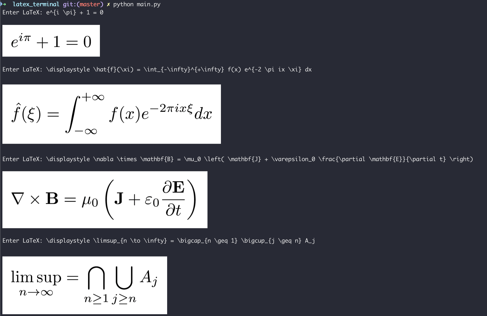

# Display LaTeX in terminal

Generate an image from a LaTeX code and display it in the terminal.

## Example

## Dependencies

- pdflatex
- imagemagick
- imgcat

## Note

The `imgcat` package works with iTerm2 (macOS) or with tmux. Could look into the `tycat` package to display images on Linux. 

In iTerm2, I had to do `export PATH=/Users/username/.iterm2:$PATH` after installing `imgcat`.

The size and quality of the generated images can be adjusted in the code via the parameters `density`, `quality` and `resize`. 

## Todo

- Add an option to just generate the image without displaying it
- Add an argument parser to play with the parameters for generating the image
- Add an option to include LaTeX packages (eg. to generate tables, plots, figures...)
- Add Linux support for image display
- Options to reuse previous command or correct it
- Support for new commands (`\R`, `\f` ...)
